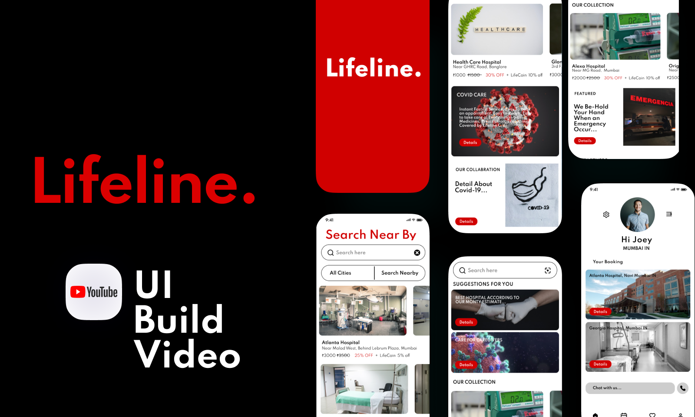
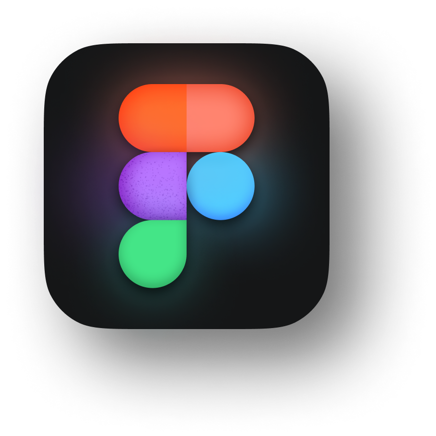
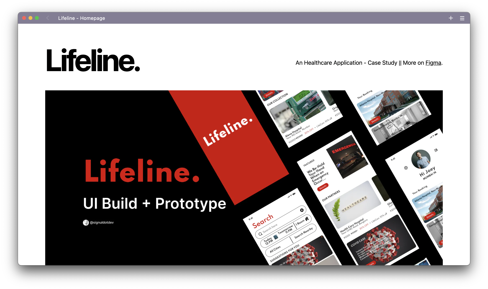
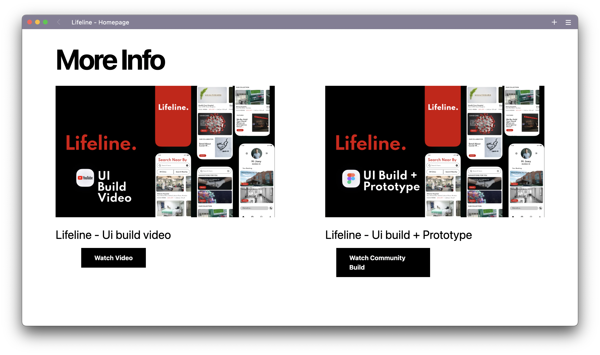

## 🎬 Idealistic Stage Startup: Lifeline - An Healthcare Application

    
    <h6>An Healthcare Application</h5>
        Logo made using <a href='https://www.figma.com/'>Figma</a>

 

## 🧑🏻‍💻 Story

Develop a prototype that could provide searching, booking, and payment options that helps patient and the hospital.

 

## 🍥 UI Design

    
    <h6>Figma</h6>
        Check out <a href='https://www.figma.com/community/file/1104722212846323572/'>UI build + Prototype</a>

## 📱 Snapshot

    
    

## 📚 Lifeline Pitch Deck

 

    
    <h6>An Healthcare Application</h5>
        Check out <a href='https://github.com/signuldotdev/lifeline-homepage/blob/main/public/Lifeline%20Pitch%20Deck.pdf'>Lifeline Pitch Deck</a>

 

---

    <h4>Made by</h4>
    
    <h4>Sanket Meshram</h4>

---
